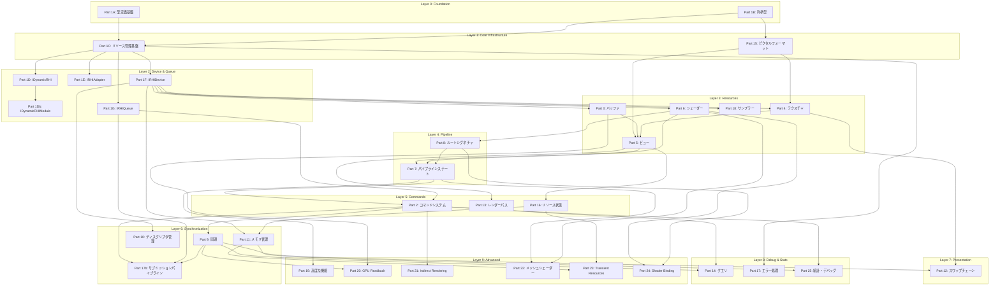

# 00-03: 依存関係グラフ

## 概要

RHIサブ計画間の依存関係を可視化。実装順序決定に使用。

## Part間依存グラフ



## 実装フェーズ

### Phase 1: 基盤 (Week 1-2)

```
Part 1A → Part 1B → Part 15 → Part 1C → Part 17
```

| 順序 | Part | 前提条件 |
|------|------|---------|
| 1 | 01-01-fwd-macros | なし |
| 2 | 01-02-types-gpu | 01-01 |
| 3 | 01-05-enums-core | 01-01 |
| 4 | 15-01-pixel-format-enum | 01-01 |
| 5 | 01-11-ref-count-ptr | 01-01 |
| 6 | 01-12-resource-base | 01-11 |
| 7 | 17-01-rhi-result | 01-01 |

### Phase 2: デバイス (Week 3-4)

```
Part 1D → Part 1E → Part 1F → Part 1G
```

| 順序 | Part | 前提条件 |
|------|------|---------|
| 8 | 01-15-dynamic-rhi-core | Phase 1完了 |
| 8.5 | 01-15b-dynamic-rhi-module | 01-15 |
| 9 | 01-18-adapter-desc | 01-15 |
| 10 | 01-19-adapter-interface | 01-18 |
| 11 | 01-20-device-core | 01-19 |
| 12 | 01-25-queue-interface | 01-20 |

### Phase 3: リソース (Week 5-7)

```
Part 3 → Part 4 → Part 5 → Part 6 → Part 18
```

並列実装可能:
- バッファ系 (03-xx)
- テクスチャ系 (04-xx)
- シェーダー系 (06-xx)

### Phase 4: パイプライン (Week 8-9)

```
Part 8 → Part 7
```

| 順序 | Part | 前提条件 |
|------|------|---------|
| 35 | 08-01-root-parameter | Phase 3完了 |
| 36 | 08-03-root-signature | 08-01 |
| 37 | 07-01-blend-state | 08-03 |
| 38 | 07-05-graphics-pso | 07-01 |

### Phase 5: コマンド (Week 10-11)

```
Part 2 → Part 13 → Part 16
```

### Phase 6: 同期・メモリ (Week 12-13)

```
Part 9 → Part 10 → Part 11
```

### Phase 6.5: サブミッションパイプライン

| 順序 | Part | 前提条件 |
|------|------|---------|
| N | 01-17b-submission-pipeline | 01-17, 01-25, 09-01, 09-02, 02-04, 02-05 |

### Phase 7: プレゼンテーション (Week 14)

```
Part 12
```

### Phase 8: 高度な機能 (Week 15-18)

```
Part 20 → Part 21 → Part 22 → Part 23 → Part 24
```

並列実装可能:
- GPU Readback (20-xx)
- Indirect Rendering (21-xx)
- メッシュシェーダー (22-xx)

## 循環依存チェック

```
✓ 循環依存なし

検証済み依存パス:
- IRHIResource → IRHIDevice ✓ (一方向)
- IRHIBuffer → IRHITexture ✓ (独立)
- IRHIFence → IRHIQueue ✓ (一方向)
- IRHIPipelineState → IRHIShader ✓ (一方向)
```

## クリティカルパス

```
01-01 → 01-11 → 01-12 → 01-20 → 03-02 → 05-01 → 07-05 → 02-03 → 09-01 → 12-02
 ↓
最短実装パス: 10サブ計画 (基本描画可能)
```

## 並列実装ガイド

```
Week    1   2   3   4   5   6   7   8   9  10  11  12  13  14
─────────────────────────────────────────────────────────────
Team A  [P1A][P1C][P1D][P1E][P1F]───[P3 ]───[P7 ]───[P2 ]───
Team B  [P1B][P15]───[P1G]───[P4 ]───[P8 ]───[P13]───[P9 ]─
Team C  ─────[P17]───────────[P6 ]───────────[P16]───[P10]─
Team D  ───────────────────────────────────────────[P11][P12]
```

## 検証

- [ ] 全Part間の依存関係を網羅
- [ ] 循環依存がないことを確認
- [ ] クリティカルパスの正確性
- [ ] 並列実装可能性の検証
