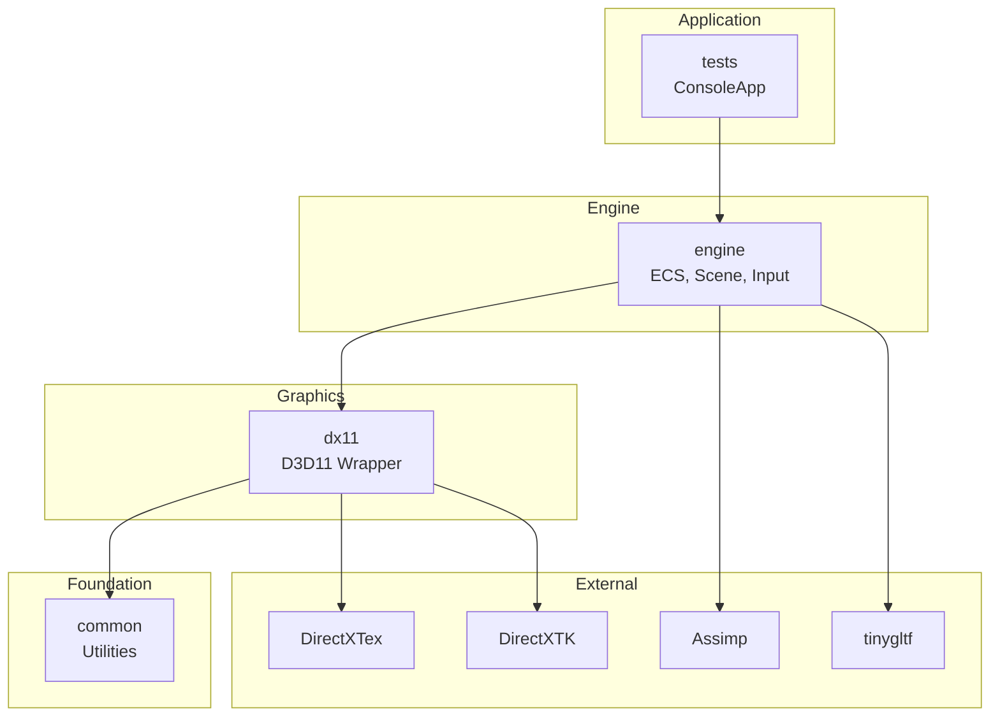

# Architecture Diagram Generator

プロジェクトアーキテクチャをASCII/Mermaid図で可視化します。

## 使用方法

- `/architecture` - 全体概要
- `/architecture --layers` - レイヤー構成図
- `/architecture --init` - 初期化フロー図
- `/architecture --frame` - フレームループ図
- `/architecture --dirs` - ディレクトリ構成図
- `/architecture --ecs` - ECSアーキテクチャ図
- `/architecture --mermaid` - Mermaid形式で出力

複数オプションの組み合わせ可能: `/architecture --layers --mermaid`

## 実行手順

### 1. プロジェクト構成の解析

`premake5.lua` からプロジェクト構成を解析:
- プロジェクト名とタイプ（StaticLib/ConsoleApp）
- 依存関係
- 外部ライブラリ

### 2. CLAUDE.mdからの情報抽出

アーキテクチャ情報を抽出:
- レイヤー構成
- 初期化順序
- フレームループ

### 3. ソースコード解析

必要に応じて以下を解析:
- `Engine::Initialize()` の初期化順序
- `Engine::Run()` のフレームループ
- ECS関連クラスの構造

## 出力例

### レイヤー構成図（--layers）

```
┏━━━━━━━━━━━━━━━━━━━━━━━━━━━━━━━━━━━━━━━━━━━━━━━━━━━━━┓
┃                    NS-ENGINE                        ┃
┣━━━━━━━━━━━━━━━━━━━━━━━━━━━━━━━━━━━━━━━━━━━━━━━━━━━━━┫
┃  [tests]  ConsoleApp - テスト実行                    ┃
┣━━━━━━━━━━━━━━━━━━━━━━━━━━━━━━━━━━━━━━━━━━━━━━━━━━━━━┫
┃  [engine] StaticLib - ECS, Scene, Input, Resources  ┃
┣━━━━━━━━━━━━━━━━━━━━━━━━━━━━━━━━━━━━━━━━━━━━━━━━━━━━━┫
┃  [dx11]   StaticLib - D3D11 Device, Buffers, States ┃
┣━━━━━━━━━━━━━━━━━━━━━━━━━━━━━━━━━━━━━━━━━━━━━━━━━━━━━┫
┃  [common] Headers   - Logging, NonCopyable, Types   ┃
┗━━━━━━━━━━━━━━━━━━━━━━━━━━━━━━━━━━━━━━━━━━━━━━━━━━━━━┛
         │
         ▼
┏━━━━━━━━━━━━━━━━━━━━━━━━━━━━━━━━━━━━━━━━━━━━━━━━━━━━━┓
┃  External: DirectXTex, DirectXTK, Assimp, tinygltf  ┃
┗━━━━━━━━━━━━━━━━━━━━━━━━━━━━━━━━━━━━━━━━━━━━━━━━━━━━━┛
```

### 初期化フロー図（--init）

```
Engine::Initialize()
         │
         ▼
┌─────────────────────────────────────────────────────┐
│  1. Memory Layer                                    │
│     └── MemorySystem                                │
├─────────────────────────────────────────────────────┤
│  2. Core Layer                                      │
│     ├── JobSystem                                   │
│     ├── InputManager                                │
│     └── FileSystemManager                           │
├─────────────────────────────────────────────────────┤
│  3. Graphics Layer                                  │
│     ├── ShaderManager                               │
│     └── RenderStateManager                          │
├─────────────────────────────────────────────────────┤
│  4. Rendering Layer                                 │
│     ├── SpriteBatch                                 │
│     └── MeshBatch                                   │
├─────────────────────────────────────────────────────┤
│  5. Resource Layer                                  │
│     ├── TextureManager                              │
│     ├── MeshManager                                 │
│     └── MaterialManager                             │
├─────────────────────────────────────────────────────┤
│  6. System Layer                                    │
│     └── SceneManager                                │
├─────────────────────────────────────────────────────┤
│  7. Debug Layer (DEBUG only)                        │
│     ├── DebugDraw                                   │
│     └── CircleRenderer                              │
└─────────────────────────────────────────────────────┘
```

### フレームループ図（--frame）

```
┌─────────────────────────────────────────────────────┐
│                    Game Loop                         │
└─────────────────────────────────────────────────────┘
                      │
                      ▼
           ┌──────────────────┐
           │   BeginFrame()   │  ← 遅延操作実行
           │  キャッシュ無効化  │    Chunk移動処理
           └────────┬─────────┘
                    │
        ┌───────────┼───────────┐
        │           │           │
        ▼           ▼           ▼
┌──────────┐ ┌──────────┐ ┌──────────┐
│  Input   │ │FixedUpdate│ │  Update  │
│ Process  │ │  (60Hz)  │ │ (VSync)  │
└────┬─────┘ └────┬─────┘ └────┬─────┘
     │            │            │
     └────────────┴────────────┘
                  │
                  ▼
         ┌──────────────────┐
         │     Render()     │  ← RenderSystems実行
         │   (interpolate)  │    alpha補間
         └────────┬─────────┘
                  │
                  ▼
         ┌──────────────────┐
         │    EndFrame()    │  ← 操作はキューに積む
         │   Present/Swap   │
         └──────────────────┘
                  │
                  └──────────▶ ループ先頭へ
```

### ECSアーキテクチャ図（--ecs）

```
┌─────────────────────────────────────────────────────┐
│                     World                           │
├─────────────────────────────────────────────────────┤
│  ActorManager    SystemScheduler    ArchetypeStorage│
└────────┬────────────────┬──────────────────┬────────┘
         │                │                  │
         ▼                ▼                  ▼
┌─────────────┐  ┌─────────────┐  ┌─────────────────┐
│   Actor     │  │   System    │  │   Archetype     │
│  (32-bit)   │  │  (ISystem)  │  │ (Component Set) │
│ idx + gen   │  │  Priority   │  │                 │
└─────────────┘  └─────────────┘  └────────┬────────┘
                                           │
         ┌─────────────────────────────────┘
         │
         ▼
┌─────────────────────────────────────────────────────┐
│                   Chunk (16KB)                       │
├─────────────────────────────────────────────────────┤
│  [Actor IDs]  [CompA_0..N]  [CompB_0..N]  [Pad]    │
│               ◀── SoA Layout ──▶                    │
└─────────────────────────────────────────────────────┘
```

### ディレクトリ構成図（--dirs）

```
NS-ENGINE/
├── source/
│   ├── common/          # Header-only utilities
│   │   ├── logging/
│   │   ├── assert/
│   │   └── stl/
│   ├── dx11/            # DirectX 11 wrapper
│   │   ├── gpu/
│   │   ├── state/
│   │   └── view/
│   ├── engine/          # Game engine
│   │   ├── core/        # Engine, Services, Jobs
│   │   ├── ecs/         # Entity-Component-System
│   │   ├── scene/       # Scene management
│   │   ├── input/       # Input handling
│   │   └── ...
│   └── tests/           # Google Test
├── assets/              # Runtime assets
│   ├── shader/
│   ├── texture/
│   └── model/
├── external/            # Third-party libs
│   ├── DirectXTex/
│   ├── DirectXTK/
│   └── googletest/
├── tools/               # Build scripts
└── premake5.lua         # Build configuration
```

### Mermaid形式（--layers --mermaid）



## 解析対象ファイル

| 図の種類 | 解析対象 |
|----------|----------|
| レイヤー | `premake5.lua` |
| 初期化 | `source/engine/core/engine.cpp` |
| フレームループ | `source/engine/core/engine.cpp`, `CLAUDE.md` |
| ECS | `source/engine/ecs/` |
| ディレクトリ | `source/` ディレクトリ構造 |

## 注意事項

- Mermaid形式はGitHubのMarkdownで直接表示可能です
- `--init` は `Engine::Initialize()` の実際のコードを解析します
- ASCII図は等幅フォントでの表示を想定しています
