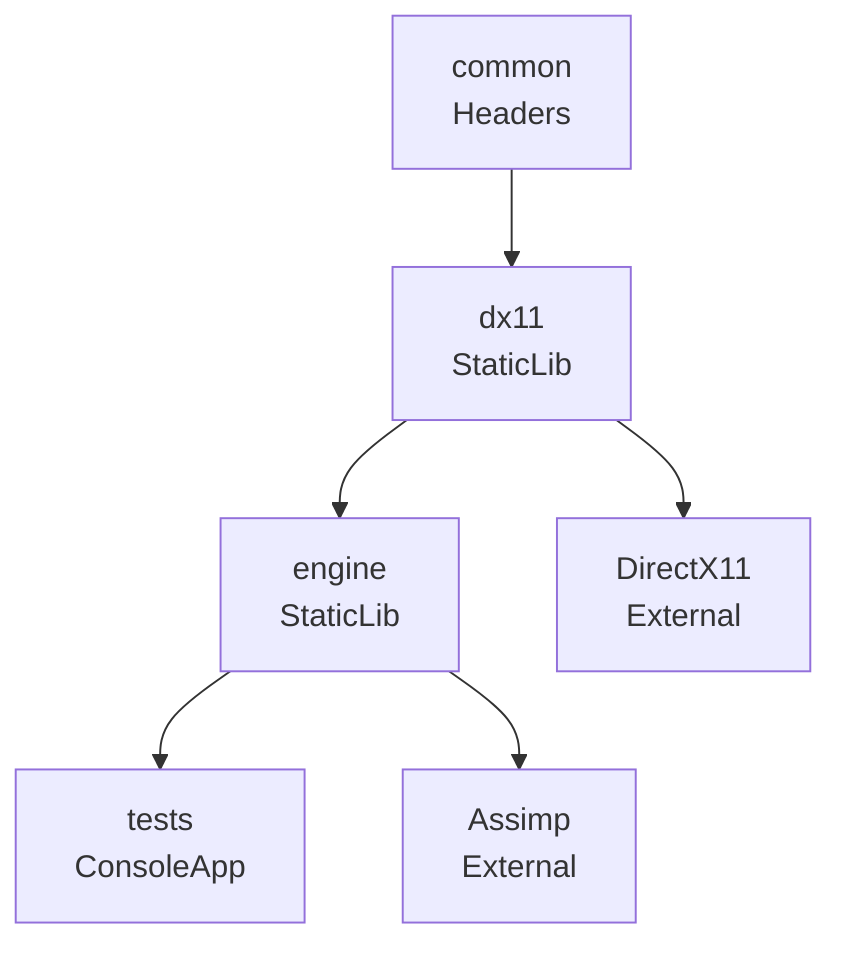

# Dependency Graph

プロジェクトのモジュール依存関係をASCII/Mermaid図で可視化します。

## 使用方法

- `/dependency-graph` - プロジェクト全体の依存概要
- `/dependency-graph --project` - プロジェクト間依存のみ
- `/dependency-graph --includes <file>` - 特定ファイルのinclude依存
- `/dependency-graph --singletons` - Singleton初期化順序
- `/dependency-graph --mermaid` - Mermaid形式で出力

## 実行手順

### 1. プロジェクト依存の解析

`premake5.lua` から以下を解析:
- `links{}` - ライブラリリンク依存
- `dependson{}` - ビルド順序依存
- `project()` - プロジェクト定義

### 2. ヘッダー依存の解析

指定ファイルの `#include` を再帰的に解析:
- `#include "..."` - プロジェクト内ヘッダー
- `#include <...>` - システム/外部ヘッダー

### 3. Singleton依存の解析

`ServiceLocator` と `SingletonRegistry` から初期化順序を解析:
- `SINGLETON_REGISTER(Name, Dependencies)`
- `Services::XXX()` の呼び出し関係

### 4. 循環依存の検出

依存グラフを構築し、循環を検出して警告を出力。

## 出力例

### プロジェクト依存（デフォルト）

```
┌─────────┐     ┌─────────┐     ┌─────────┐
│ common  │ ──▶ │  dx11   │ ──▶ │ engine  │
└─────────┘     └─────────┘     └─────────┘
                     │               │
                     ▼               ▼
              ┌───────────┐   ┌───────────┐
              │ DirectX11 │   │  Assimp   │
              └───────────┘   └───────────┘
                                   │
                                   ▼
                            ┌───────────┐
                            │   tests   │
                            └───────────┘
```

### Include依存（--includes）

```
source/engine/ecs/world.h
├── source/engine/ecs/actor.h
│   └── source/common/common.h
├── source/engine/ecs/archetype.h
│   ├── source/engine/ecs/chunk.h
│   └── source/engine/ecs/component_data.h
└── source/engine/ecs/system.h
    └── source/engine/ecs/world.h (circular!)
```

### Singleton初期化順序（--singletons）

```
Initialization Order:
  1. MemorySystem         (no deps)
  2. JobSystem            (no deps)
  3. InputManager         (no deps)
  4. FileSystemManager    (no deps)
  5. ShaderManager        → GraphicsDevice
  6. RenderStateManager   → GraphicsDevice
  7. SpriteBatch          → GraphicsDevice, GraphicsContext
  8. MeshBatch            → GraphicsDevice, GraphicsContext
  9. TextureManager       → GraphicsDevice, GraphicsContext
 10. MeshManager          → GraphicsDevice
 11. MaterialManager      → TextureManager, ShaderManager
 12. SceneManager         (no deps)
```

### Mermaid形式（--mermaid）



## 解析対象ファイル

| 対象 | ファイル |
|------|----------|
| プロジェクト構成 | `premake5.lua` |
| Singleton定義 | `source/engine/core/singleton_registry.h` |
| ServiceLocator | `source/engine/core/service_locator.h` |
| 初期化順序 | `source/engine/core/engine.cpp` |

## 注意事項

- 循環依存が検出された場合、警告メッセージとともに該当箇所を表示します
- 大規模なinclude解析は時間がかかる場合があります
- Mermaid形式はGitHubのMarkdownで直接表示可能です
